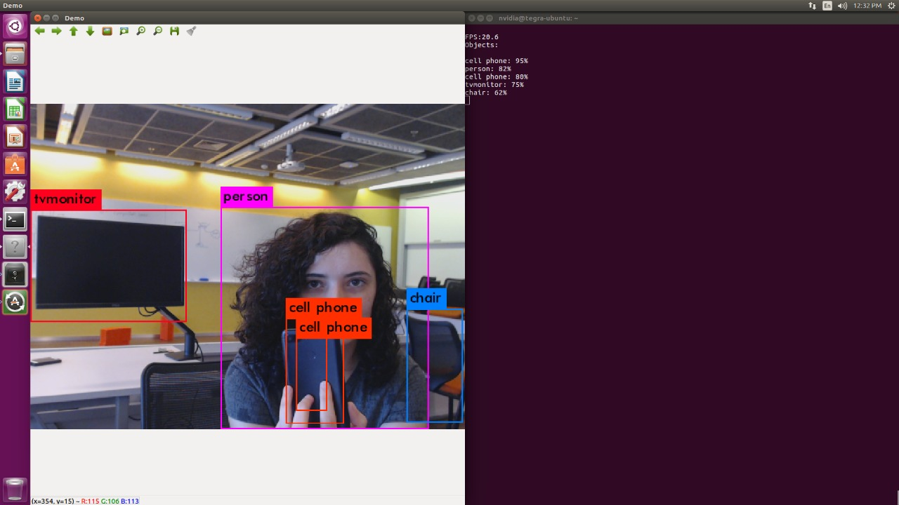

# YOLOV3 no Jetson Carrier Board J120 ou Development Kit TX2 



# O que vamos precisar

- JetsonTX2 com o JetPack 3.2.1 Instalado [Temos um tutorial para o Development Kit aqui](Tutorial_JetPack3.2.1_JetsonTX2.md) e [um para o Carrier Board J120 aqui](Tutorial_JetPack3.2.1_JetsonTX2.md)
- OpenCV 3.4.0 Instalado na JetsonTX2 *Temos um script que remove o Opencv nativo e instala o Opencv 3.4.0 na sua Jetson TX2* [aqui](https://github.com/Insper/404/blob/master/Jetson_TX2/instala_opencv3.4.0_JetsonTX2.sh)
- Mouse/Teclado/Tela
- Conexão com Internet

# Configurando e Compilando o YOLOV3 na sua Jetson TX2

-  Clone o repositorio github do Darknet, em um terminal digite; 

```
 cd ~/
 git clone https://github.com/pjreddie/darknet yolov3
cd ~/yolov3

```

- Ainda no terminal, digite;

```
gedit Makefile

```

- Faça as seguintes modificaões no seu arquivo;

```
-D
GPU=1
CUDNN=1
OPENCV=1
......
ARCH= -gencode arch=compute_53,code=[sm_53,compute_53] \
      -gencode arch=compute_62,code=[sm_62,compute_62]
      
```

- Salve e feche o arquivo, depois digite no terminal;

```
make

```

- Faça o Download de uma malha treinada [COCO Yolo v3 tiny](https://pjreddie.com/media/files/yolov3-tiny.weights)
- Mova o arquivo para a pasta do Yolo com o comando

```
mv ~/Download/yolov3-tiny.weights  ~/yolov3/
```

# Hora de testar!

- Configure sua JetsonTX2 para rodar na máxima potência usando [esse script](https://github.com/Insper/404/blob/master/Jetson_TX2/max_performance.sh)
ou digite os comandos a seguir no seu terminal

```
sudo nvpmodel -m 0
sudo ~/jetson_clocks.sh

```

- Para Rodar o Yolo usando uma Câmera USB use o comando:
*Aonde -c 1 é o valor do device da sua câmera, se não rodar com -c 1, tente -c 0 

```
cd  ~/yolov3
./darknet detector demo cfg/coco.data cfg/yolov3-tiny.cfg yolov3-tiny.weights  -c 1

```

- Para Rodar o Yolo em um arquivo de video .mp4

```
cd ~/yolov3
./darknet detector demo cfg/coco.data cfg/yolov3.cfg yolov3.weights \ video.mp4

```


