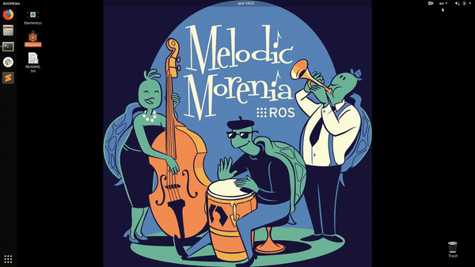
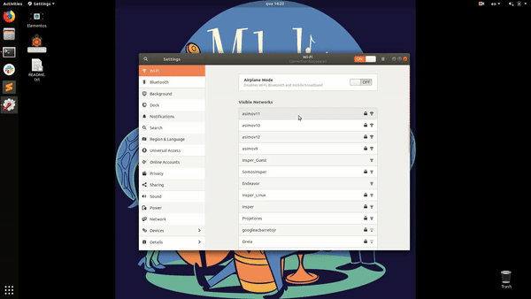
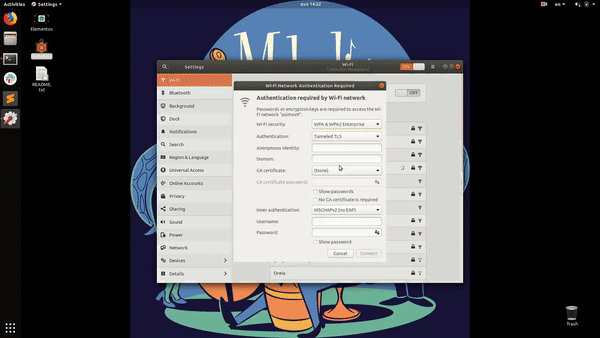

Este guia passo-a-passo orienta os usuários na configuração de acesso à rede wireless Asimov do INSPER. Todos os passos devem ser executados para que o acesso a rede Wi-Fi funcione corretamente.

#  Rede Asimov

O laboratório de Informatica disponibiliza uma infraestrutura de rede Wifi Asimov que tem autorização para acessar e navegar na internet, essa rede deve somente ser utilizada para desenvolvimento de aplicações e projetos relacionados as disciplinas ministradas no laboratório.

# Criação de usuario e senha

O acesso é feito através de autenticação de usuarios cadastrado nas disciplinas ministradas no laboratório. Para criar seu usuario de acesso, entre em contato com o técnicos do laboratório para realizar o seu cadastro.

As informações de usuario e senha são de uso pessoal, não é permitido o compartilhamento dessas informações. 

# Como se conectar

- Linux (Ubuntu 18.04)

1 - Clique no painel superior direito, próximo ao icone da bateria;
2 - Navegue até Wi-fi e selecione Wi-fi settings.

3 - Nas configurações Wi-fi irão aparecer as redes asimov disponíveis;
4 - Selecione uma das redes asimov para se conectar. 

5 - Nas configurações de autenticação de rede, selecione as opções abaixo:
 
Em Autentication selecione **Protected EAP (PEAP)**
Marque a opção **No CA Certificate is required**
Coloque suas credenciais cadastradas em **Username e Password**
Não é necessário alterar nenhum outro parâmetro.

6 - Clique em conectar e pronto!

**Caso ocorra algum problema para conectar, peça ajuda dos técnicos de laboratório.**

