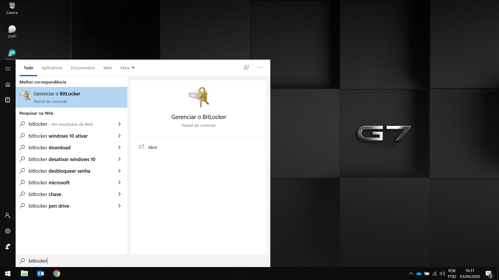
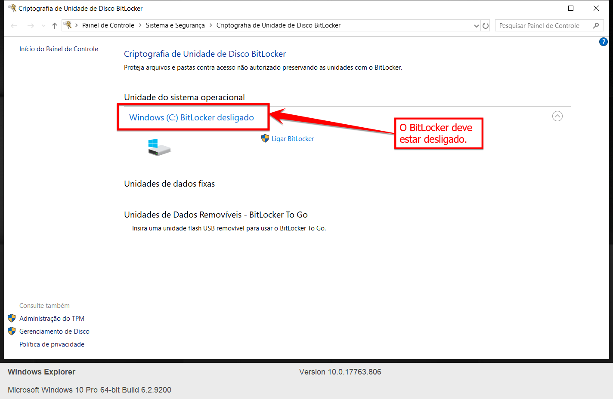
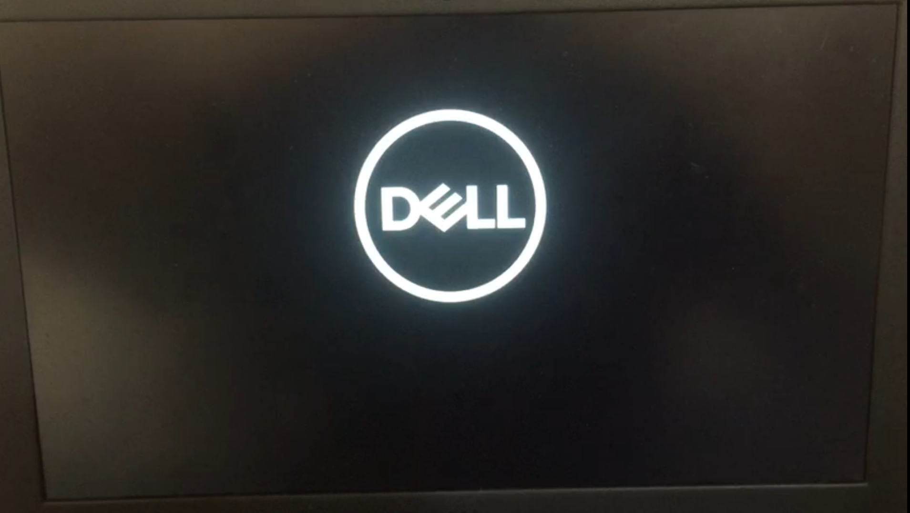
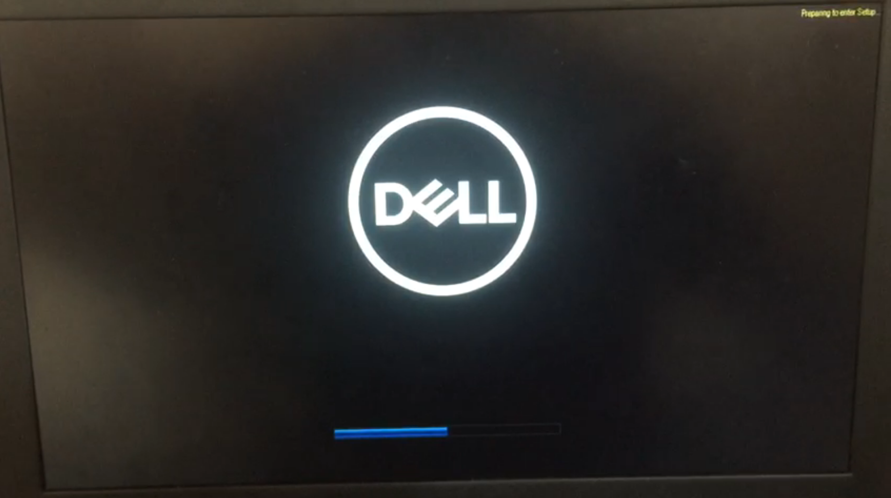
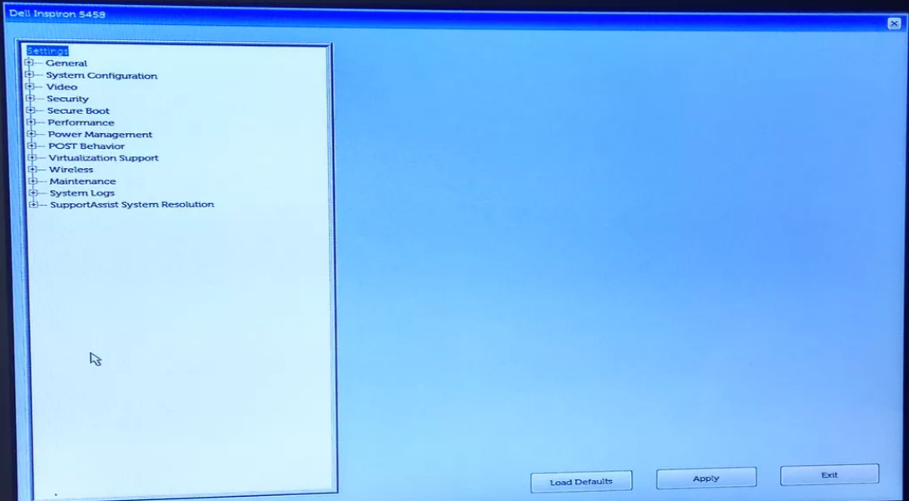
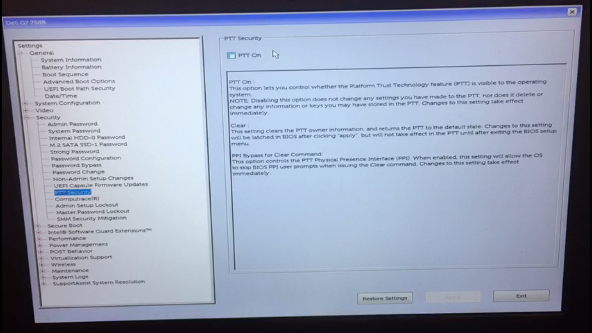
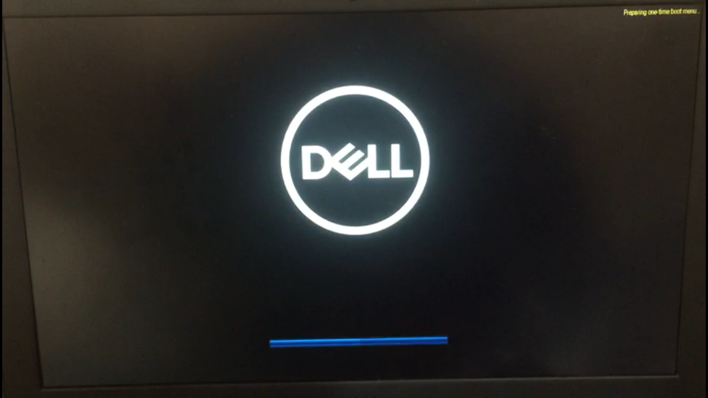
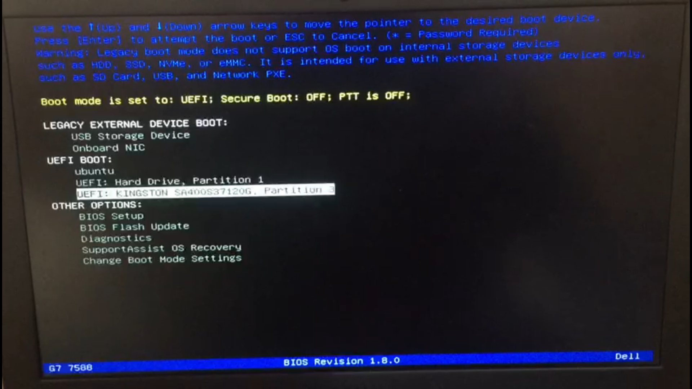
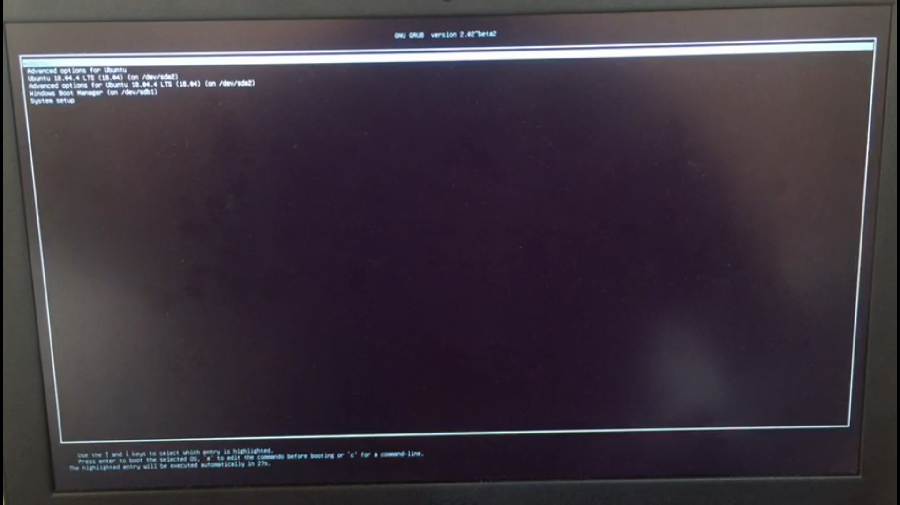
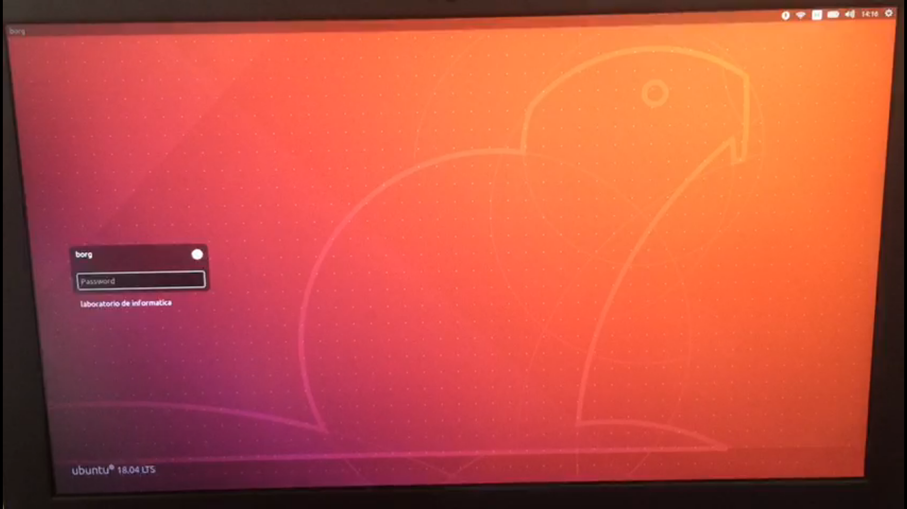

# Configurações de BIOS para Boot do SSD.

Exemplo de configuração em um notebook Dell e numeração do SSD do tipo **0xB...**, que são SSD's com tabela de formação *GPT*.

>De forma geral, este procedimento pode ser reproduzido em notebooks de outras marcas, sendo feitas as adaptações para cada BIOS.

# ETAPA 1

## Desabilitando o BitLocker

Com o Windowns inicializado, pesquise por **Bitlocker** no menu iniciar. 

O Bitlocker deve estar desabilitado, como aparece na imagem abaixo. Se o BitLocker estiver ligado, **Desligue**.

    
 # ETAPA 2

## Acessando a BIOS

Para acessar a BIOS, é necessário:

1. Desligue o notebook;
2. Concecte o SSD na USB;
3. Ligue o notebook;
4. Assim que a logomarca da **Dell** aparecer, pressione tecla **F2**, varias vezes se necessário, caso tenha um notebook de outra marca pesquise qual tecla deve ser precionada.

Quando pressionar a tecla **F2** irá aparecer uma mensagem no canto superior direto. 

Se tudo deu certo, deve aparecer uma tela parecida como da imagem abaixo.

> Para maquinas diferentes de Dell, é esperado que a interface da Bios seja diferente.

## O que vamos alterar

>Lembrete, estamos fazendo a configuração para boot apenas do SSD numeração **0xB...**.

Vá em *Security* --> *PPT Security*: Deixe a opção *PPT On* desmarcada.

Em *General* --> *Boot Sequence*: Verifique se aparece marcada a opção **UEFI: kingston ....... Partition 3**, igual a imagem abaixo.  

Salves as alterações em **Aplly** e **Exit** para sair da BIOS e reiniciar o notebook. 

## Inicializando o SSD

Para inicialiar o boot pelo SSD, é necessário:

1. Desligue o notebook;
2. Concecte o SSD na USB;
3. Ligue o notebook;
4. Assim que a logomarca da **Dell** aparecer, pressione tecla **F12**, varias vezes se necessário, caso tenha um notebook de outra marca pesquise qual tecla deve ser precionada.

Quando pressionar a tecla **F12** irá aparecer uma mensagem no canto superior direto. 

5. Nas opções de Boot escolha a opção **UEFI: kingston ....... Partition 3** e pressione ENTER. 

6. Irá carregar a tela de grub do linux. Não é preciso alterar nada, apenas pressione ENTER. 

Se tudo ocorrer bem, o Linux irá inicializar.

Agora podemos usar o linux para as aulas e atividades do semestre.

Bons estudos!!!
