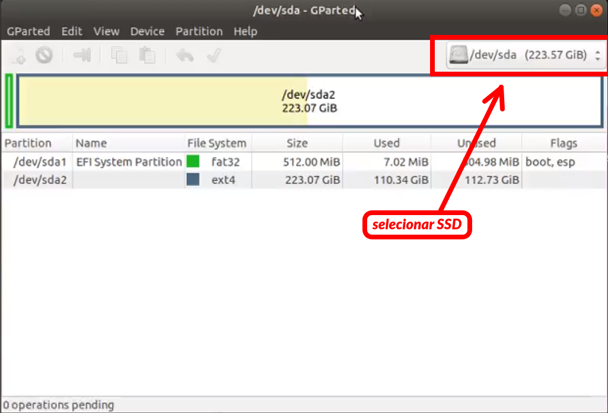
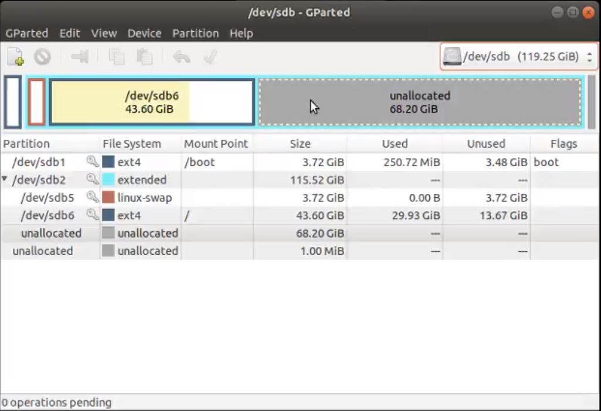
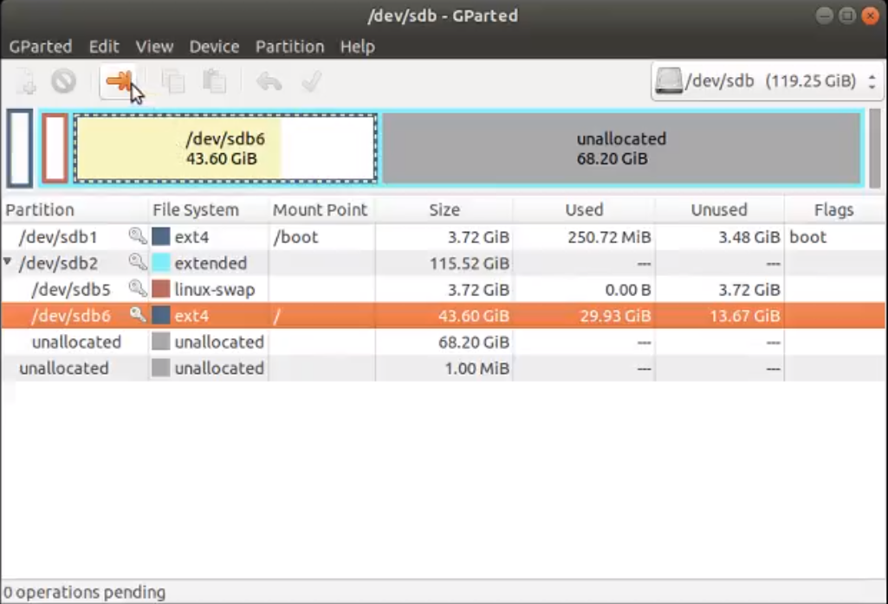
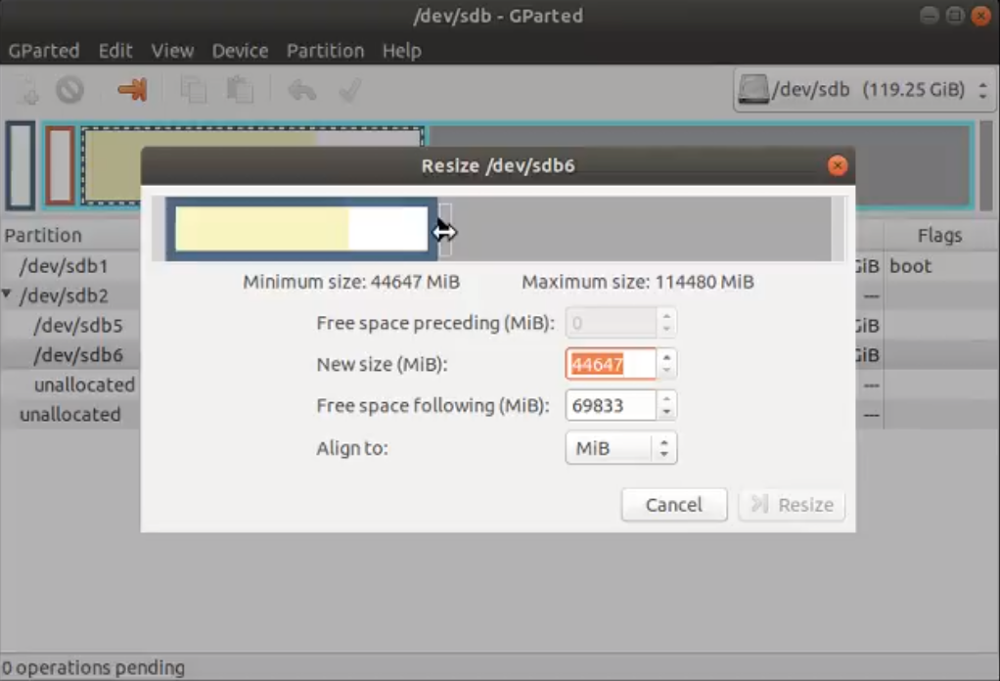
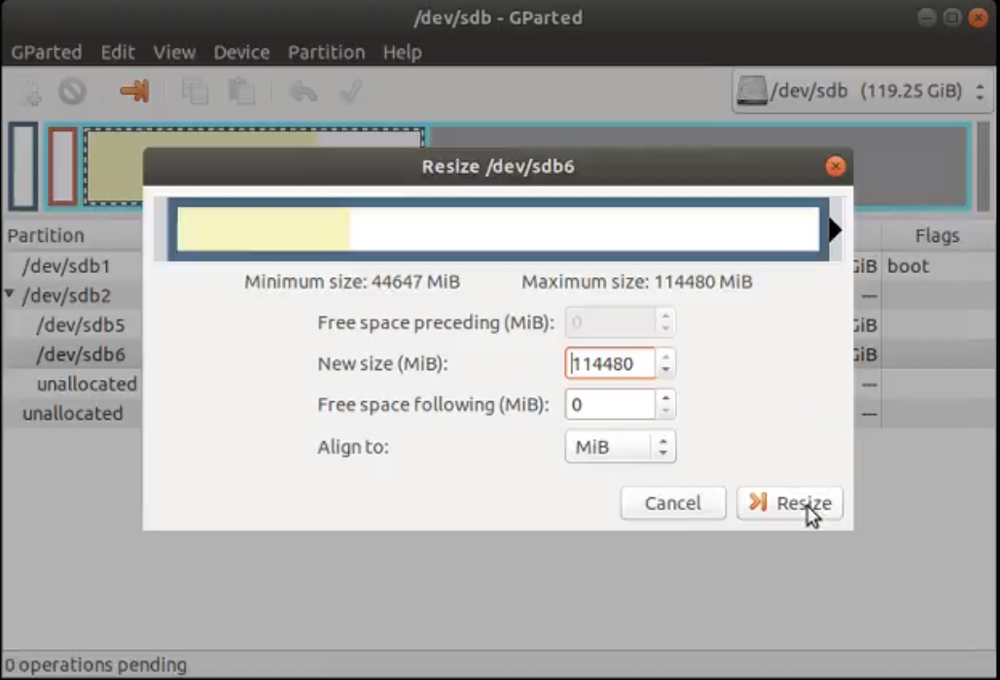
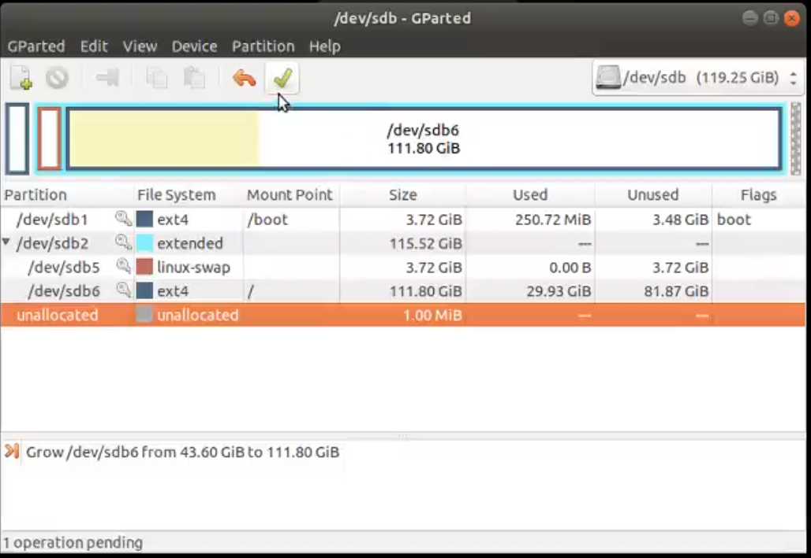
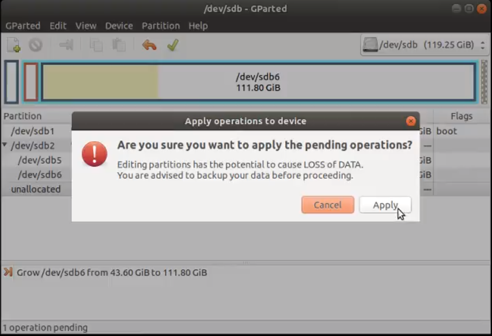
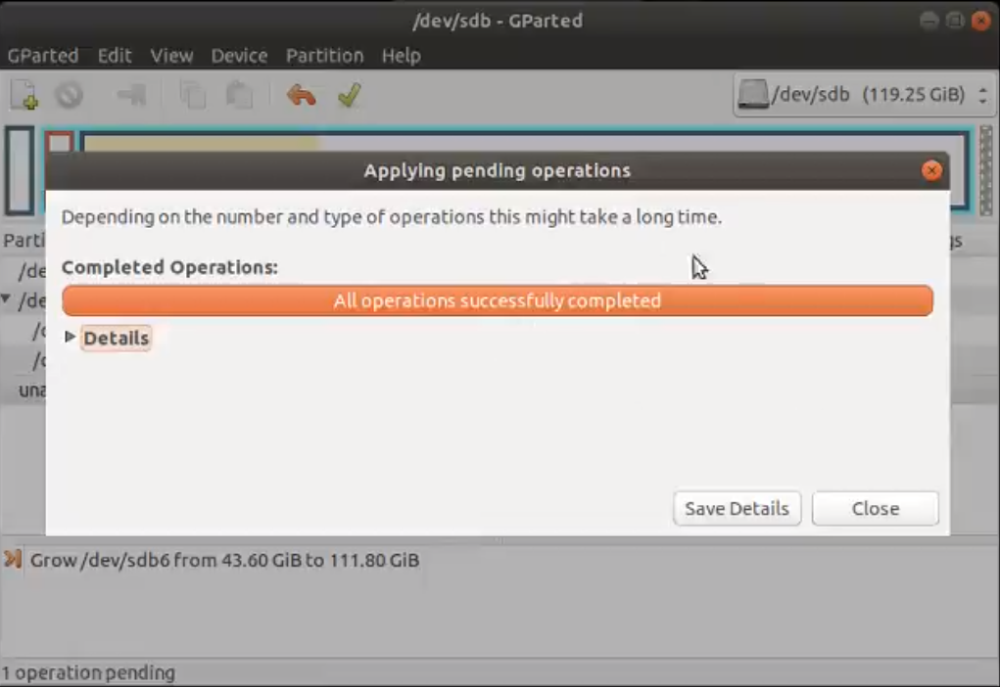
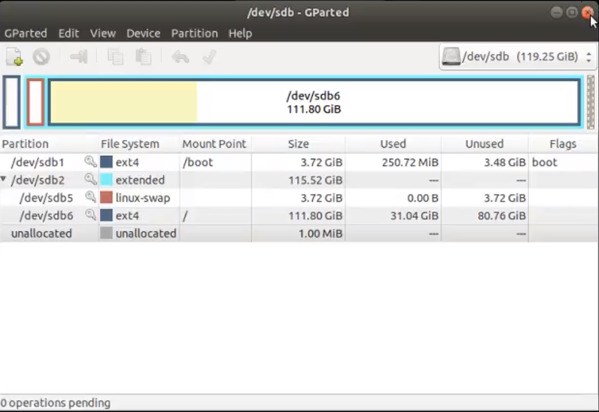

# Expandir SSD

## ETAPA1

**SSD COM NUMERAÇÃO DO TIPO *A*, OU SEJA, 0*A*x... são SSD's com formato *MBR*, pular ETAPA 2**.
 
**SSD COM NUMERAÇÃO DO TIPO *B*, OU SEJA, 0*B*x... SÃO SSD's com formato *GPT*, Não precisa fazer seguir este guia.**

Este guia se destina **apenas** aos alunos com o SSD com numeração do **0xA...**.

 ## ETAPA 2

Primeiramete, você deve estar logado no SSD, ou seja, deve estar com linux do SSD inicializado para realizar ao processo de expanção do SSD. 

Abra um terminal novo (Crtl+Alt+T):

**Caso** o programa **gparted** ainda não esteja instalado, execute o comando abaixo:

        sudo apt install gparted

Para executar o gparted, digite:

        sudo gparted

Se aparecer alertas na inicialização do *gparted*, clique em **ignore**.

Com o *gparted* inicializado, selecione a partição do SSD, a seleção é feita na parte superio direita. 

>Dica: O SSD provavelmente será a partição */dev/sd**b*** ou */dev/sd**c***.

O próximo passo é selecionar a partição montada no **/** para expandir, é a partição com final **6**, no meu caso,  /dev/sd**b6**. 

Clique sobre a particiçao e selecionar, e depois clique em *resize*, **seta alaranjada**. 

Clique e segure na barra e arraste para o máximo da direita.

Clique em *resize*, **seta alaranjada**. 

Com o resize concluído, precisamos agora aplicar a alteração feita.Clique *aplly*,**check verde**.

Aguarde alguns instantes e no final clique em *close*.

Pronto!! agora temos o SSD expandido com todo o espaço disponível. 

Pode fechar o gparted, e usar normalmente.

 
